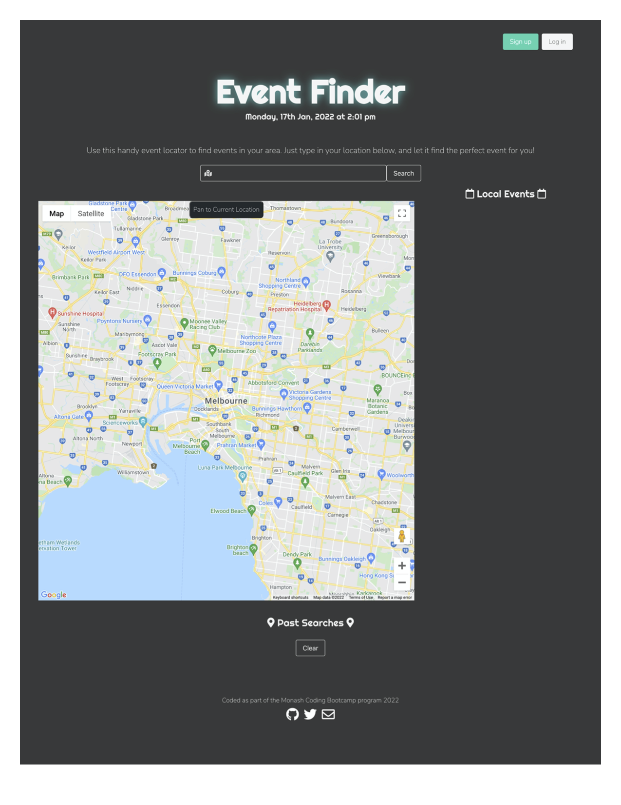
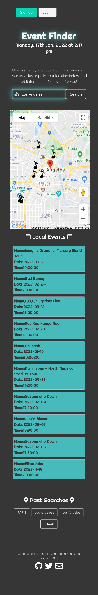

# Event Finder

## Table of contents
* [General info](#general-info)
* [API Used](#api-used)
* [Description](#description)
* [Working Application](#working-application)
* [Demo](#demo)

## General info
The project is a web application which allows users to search for events in their chosen cities, and displays the locations of these events using markers on a map.

The application was created using HTML and Javascript, as well as CSS and Bulma CSS framework.
 

The project was motivated by the following USER STORY:
 
AS A person who is interested in music events
 
I WANT to find music events in the location of my choice,
 
THEN I want to see their location on a map, in relation to my searched location
 

## API used

<li>Google Maps </li>
<li> TicketMaster </li>

 

## Description
The project:

<li> uses geolocation to locate the user's machine, and pans to that location on a map, as soon as the page is opened </li>
<li> allows the user to search for events based on their chosen city by using the Ticketmaster API </li>
<li> displays a list of 10 events, with artist name, date and time </li>
<li> pans to the selected city, and displays a customised marker at the location of each event, enabling the user to get a visual representation of the event's location. </li>
<li> saves a list of the user's searches and displays the most recent five searches at the bottom of the page </li>
<li> allows the user to click on any of their most recent searches to quickly retrieve information about events in that city </li>
</li>
 
 

## Working Application
The project can be viewed at: <a href="https://ekubik.github.io/event-finder/">https://ekubik.github.io/event-finder/ </a>

 
 

## Demo

The design of the application is responsive, with the contents adjusting for best view on different screen sizes:

 

